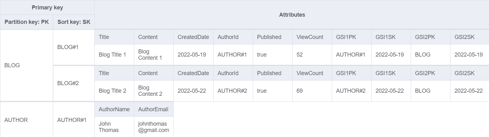
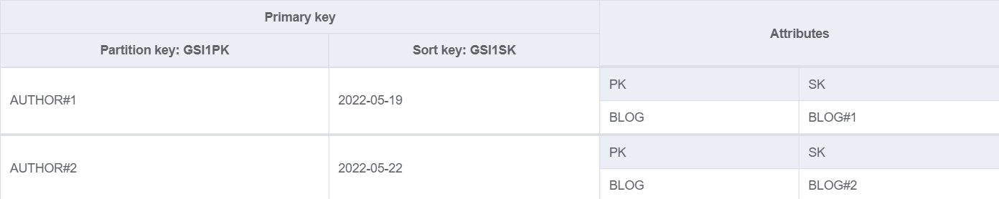
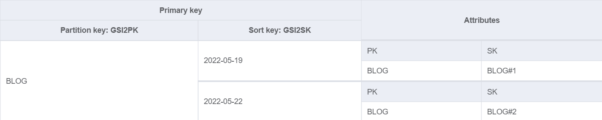

# Sample Blog API using DynamoDB Wrapper

This is a sample Blog API application written in ASP.NET 6 to explain how to use DynamoDB repository in real-world application.


## Prerequisite - A DynamoDB table named "Blogs"
This application is configured to connect with local DynamoDB. As you can see, `appsettings.Development.json` contains following settings.
```
  "DynamoDb": {
    "LocalMode": true,
    "LocalServiceUrl": "http://localhost:8000",
    "TableNamePrefix": ""
  }
```
All you need to do is deploy the DynamoDB table and then run `BlogApplication.API` project.

**Note:** If you don't want to work with local DynamoDB, then you can set `LocalMode` to `false`.

## Deploying Blogs table
You can find JSON templates for DynamoDB table used in this application at below location:
```
.\samples\dynamodb-sample-app\BlogApplication.API\DataModel\BlogDataModel-CLI.json
.\samples\dynamodb-sample-app\BlogApplication.API\DataModel\BlogDataModel-Workbench.json
```
You can deploy above table to DynamoDB in 2 ways.
- Using AWS CLI
- Using NoSQL WorkBench

When using **AWS CLI**, use below command to create a DynamoDB table.
```
// Local DynamoDB
aws dynamodb create-table --cli-input-json file://BlogDataModel-CLI.json --endpoint-url http://localhost:8000

// AWS DynamoDB
aws dynamodb create-table --cli-input-json file://BlogDataModel-CLI.json --region us-east-1
```

When using **NoSQL WorkBench**, you can simply import `BlogDataModel-Workbench.json` to create DataModel, and then commit the DataModel to Amazon DyanamoDB by choosing one of the valid connections to DynamoDB.


## Data Access Patterns
1. Get all blogs sorted by date
2. Get blogs by author
3. Get blog by id
4. Get all authors
5. Get author by id

## Single Table Design
### Base Table


### GSI_Blogs_BlogsByAuthor


### GSI_Blogs_BlogsByCreatedDate



## API Endpoints
| Operation      | Endpoint | Type | DynamoDB Operation|
| ----------- | ----------- | ----------- | ----------- |
| Save Author | /api/author | POST | Put |
| Get Author | /api/author/\{id} | GET | Load|
| Get Author List | /api/author/list | GET | Query |
| Delete Author | /api/author/\{id} | DELETE | Delete |
| Save Blog | /api/blog | POST| Put |
| Get Blog List | /api/blog/list | GET| Query with GSI & Batch Get |
| Get Blogs By Author | /api/blog/list/author/\{authorId} | GET| Query with GSI & Batch Get |
| Get Blog | /api/blog/\{blogId} | GET| Load |
| Delete Blog | /api/blog/\{id} | DELETE| Delete |

## How to test endpoints
1. Set **BlogApplication.API** as a startup project and hit F5.
2. This launches the application and opens a swagger UI page.
3. First create a few author and then blog records by hitting the POST endpoints of API using swagger UI.
4. Finally, test GET and DELETE endpoints by selecting and deleting records.
